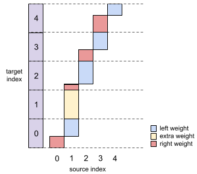

# torch-cif

A fast parallel implementation pure PyTorch implementation of *"CIF: Continuous Integrate-and-Fire for End-to-End Speech Recognition"*  https://arxiv.org/abs/1905.11235.

## Usage
```python
def cif_function(
    input: Tensor,
    alpha: Tensor,
    beta: float = 1.0,
    padding_mask: Optional[Tensor] = None,
    target_lengths: Optional[Tensor] = None,
    max_output_length: Optional[int] = None,
    eps: float = 1e-6,
) -> Tuple[Tensor, Tensor, Tensor, Tensor]:
    r""" A fast parallel implementation of continuous integrate-and-fire (CIF)
    https://arxiv.org/abs/1905.11235

    Args:
        input (Tensor): (N, S, C) Input features to be integrated.
        alpha (Tensor): (N, S) Weights corresponding to each elements in the
            input. It is expected to be after sigmoid function.
        beta (float): the threshold used for determine firing.
        padding_mask (Tensor, optional): (N, S) A binary mask representing
            padded elements in the input.
        target_lengths (Tensor, optional): (N,) Desired length of the targets
            for each sample in the minibatch.
        max_output_length (int, optional): The maximum valid output length used
            in inference. The alpha is scaled down if the sum exceeds this value.
        eps (float, optional): Epsilon to prevent underflow for divisions.
            Default: 1e-4

    Returns: Tuple (output, feat_lengths, alpha_sum, delays)
        output (Tensor): (N, T, C) The output integrated from the source.
        feat_lengths (Tensor): (N,) The output length for each element in batch.
        alpha_sum (Tensor): (N,) The sum of alpha for each element in batch.
            Can be used to compute the quantity loss.
        delays (Tensor): (N, T) The expected delay (in terms of source tokens) for
            each target tokens in the batch.
    """
```

## Convergence
The figure below shows a implementation for the speech recognition task on MuST-C. The decoder is autoregressive and takes as input the sum of target embeddings and integrated speech features. Orange: reference seq2seq model. Gray: train from scratch. Purple: load encoder from seq2seq model.


## Note
- This implementation uses `cumsum` and `floor` to determine the firing positions, and use `scatter` to merge the weighted source features. The figure below demonstrates this concept using *scaled* weight sequence `(0.4, 1.8, 1.2, 1.2, 1.4)`



- Run test by `python test.py` (requires `pip install expecttest`).
- Feel free to contact me if there are bugs in the code.

## Reference
- [CIF: Continuous Integrate-and-Fire for End-to-End Speech Recognition](https://arxiv.org/abs/1905.11235)